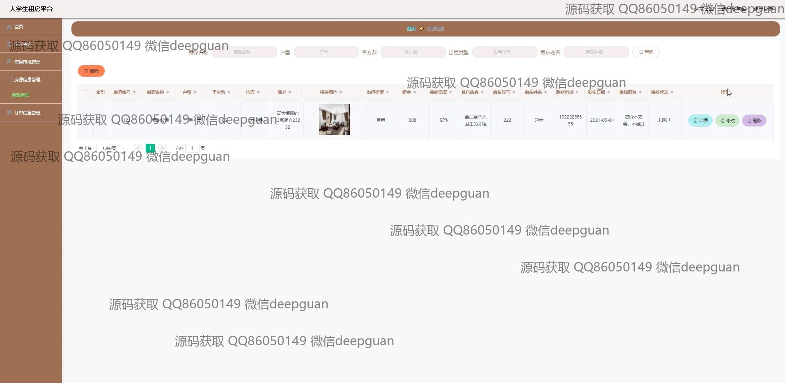
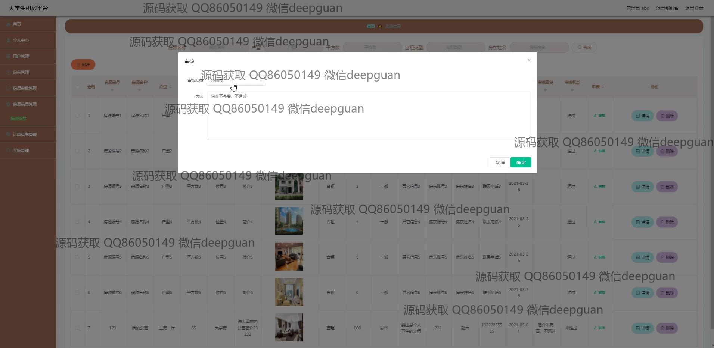

<h1 align="center">大学生租房平台的设计与实现</h1>

## 简介
大学生租房平台：角色分为管理员、用户和房东；功能包括用户和房东注册与登录、房源信息管理与审核、用户信息与操作管理、房源搜索和收藏、信息提交与审核等，界面设计简洁明了，用户体验良好。    --计算机毕业设计源码；毕设源码；java毕业设计源码

## 联系方式

<h3 align="center">获取完整代码与数据库文件 + 微信：deepguan QQ: 86050149 QQ群: 783742310</h3>

<h3 align="center">可帮忙远程部署 包运行成功！提供远程部署、修改代码、设计文档指导、代码讲解等服务！</h3>

## 功能介绍（完整见运行截图）
管理员：基本功能包括登录、注册和退出；管理界面提供房源、用户、订单等信息的管理和审核功能；可以通过选择审核状态和备注进行房源或用户审核；房源信息管理模块支持房源的详细信息查看、编辑和删除操作；管理员可以通过后台管理页面进行房源发布，更新房源信息及相关资源的管理；可以使用搜索和筛选功能快速找到所需信息，提供简洁高效的管理体验。

用户：可以通过注册和登录功能访问个人中心管理个人信息，包括更新用户信息如用户名、密码、个人照片和联系方式等；可以上传身份证和房产证等文件以完成身份认证；房源信息浏览和搜索功能让用户查找和比较不同的租房选项；用户可以将心仪房源加入收藏，进行房屋照片浏览和详细信息查看；用户中心提供信息修改功能，便于随时更新个人数据和查看相关订单。

房东：房东注册功能允许填写基本信息如房东编号、姓名、身份证号和联系方式等；可以发布房源信息，输入详细的房屋信息如房源编号、名称、户型、位置、装修情况及联系方式；上传房屋照片，添加描述，并设置租金和出租类型；通过房源信息管理模块查看和更新其房源的状态和相关详情；房东可以通过个人中心查看和管理自身的房源订单及审核状态。

审核员：负责平台上房源和用户信息的审核；通过审核功能页面对提交的房源信息和用户注册请求进行评估，选择是否通过审核并填写审核意见；审核界面提供详细的房源和用户信息展示，支持审核状态的更改及备注录入；可以通过管理界面进行高效的信息审核和管理，确保平台上的信息真实可靠，提高平台的运营质量和安全性。

## 运行截图

本代码来源于网络,仅供学习参考使用!

